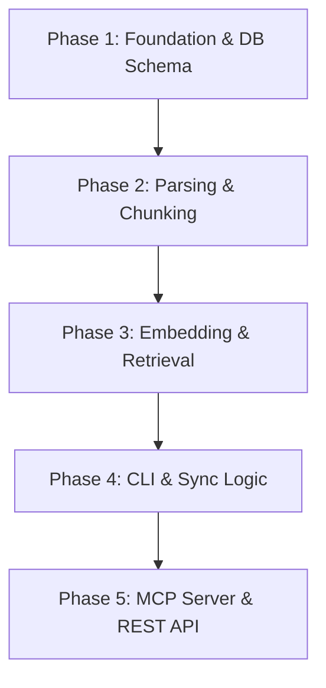

# Symaira-Seek: Architecture and Implementation Plan

Symaira-Seek is a local, CGO-free document retrieval tool for AI agents, delivered as a CLI tool, MCP server, and local HTTP daemon. It is based on the SQLite + FTS5 + Vector Search + RRF (Reciprocal Rank Fusion) hybrid search pattern.

This document describes the 5-phase implementation plan for the foundation and architecture of the tool.

> The design rationale, target metrics, and open feature recommendations distilled
> from the original Symaira-Seek deep-research report live in
> [`docs/research/`](docs/research/README.md).

---

## Phase Overview



---

## Phase 1: Foundation & DB Schema (CGO-free SQLite)
In this phase, we establish the project foundation and set up the SQLite database. To comply with Symaira design guidelines, we use a **100% CGO-free SQLite library** (`modernc.org/sqlite`) and enable **WAL mode** for secure, parallel read and write access.

### Tasks
1. **Project Initialization**:
   - Initialize the Go module `github.com/danieljustus/symaira-seek`.
   - Set up the folder structure (`cmd/symseek/`, `internal/db/`, `internal/parser/`, `internal/engine/`, `internal/mcp/`, `internal/server/`).
   - Create developer guidelines (`CLAUDE.md`, `AGENTS.md`).
2. **Database Schema Design**:
   - `documents` table for storing metadata and hashes of indexed documents:
     ```sql
     CREATE TABLE IF NOT EXISTS documents (
         path TEXT PRIMARY KEY,
         hash TEXT NOT NULL,
         updated_at DATETIME NOT NULL
     );
     ```
   - `chunks` table for storing text fragments and their embeddings:
     ```sql
     CREATE TABLE IF NOT EXISTS chunks (
         id TEXT PRIMARY KEY,
         document_path TEXT NOT NULL,
         chunk_index INTEGER NOT NULL,
         content TEXT NOT NULL,
         embedding TEXT NOT NULL, -- JSON-encoded vector data
         hash TEXT NOT NULL,
         FOREIGN KEY(document_path) REFERENCES documents(path) ON DELETE CASCADE
     );
     ```
   - FTS5 virtual table `chunks_fts` for efficient keyword matching:
     ```sql
     CREATE VIRTUAL TABLE IF NOT EXISTS chunks_fts USING fts5(
         content,
         content='chunks',
         content_rowid='id'
     );
     ```
   - Triggers for automatic FTS5 synchronization on insert/delete in `chunks`.
3. **Core DB Helpers & Cosine Similarity**:
   - Implement CRUD operations for documents and chunks.
   - Implement mathematically optimized cosine similarity calculation in Go for vector rescoring.

---

## Phase 2: Parsing & Chunking Engine
This phase implements document reading and splitting. The goal is to divide documents into manageable, semantically meaningful chunks and process them incrementally.

### Tasks
1. **Filesystem Parser**:
   - Implement a universal parser for Markdown files (`.md`), plain text files (`.txt`), and standard source code files (`.go`, `.py`, `.js`, etc.).
   - Extract header structures and file metadata.
2. **Recursive Character Text Splitter**:
   - Implement an algorithm that splits text based on a hierarchy of separators (`\n\n`, `\n`, ` `, ``).
   - Target size: 400–512 tokens (or characters as approximation) with 10–20% overlap.
3. **Change Detection (SHA-256)**:
   - Implement SHA-256 hashing at chunk and file level.
   - Algorithm to determine whether a document has been modified to avoid unnecessary embedding generations.

---

## Phase 3: Embedding & Retrieval Pipeline
Here we implement the core functionality for vector calculation and hybrid search.

### Tasks
1. **Dual Embedding Pipeline**:
   - Primary integration with a local **Ollama instance** (`nomic-embed-text` with 768 dimensions).
   - Robust, deterministic **Local Hash-Vector Fallback** (pure Go) when Ollama is not reachable. This keeps the tool functional offline/standalone.
2. **Hybrid Search Engine**:
   - **BM25 Search**: Query the SQLite FTS5 table to find exact word matches.
   - **Vector Search**: Cosine similarity search over the chunks stored in SQLite.
3. **RRF (Reciprocal Rank Fusion)**:
   - Merge and reweight search results based on ranks rather than scores.
   - Formula: $RRF(d) = \sum_{m \in M} \frac{1}{60 + r_m(d)}$
   - Return the top-$K$ most relevant document excerpts.

---

## Phase 4: CLI & Sync Logic
In this phase, we complete the developer interface and the filesystem synchronization mechanism.

### Tasks
1. **Cobra CLI Setup**:
   - Create the global CLI alias `symseek`.
   - Implement:
     - `symseek search "search term"`: Outputs hybrid search results in standard format or as JSON.
     - `symseek index /path/to/folder`: Scans and indexes a local directory.
     - `symseek status`: Shows statistics about indexed documents, chunks, and database size.
     - `symseek config`: Configures paths and API URLs.
2. **Sync Daemon / Directory Scanner**:
   - Implement a crawler that scans directories, reindexes changed files (SHA-256 comparison), and cleans up deleted files from the database.
   - Avoid race conditions through queue-based processing with backpressure.

---

## Phase 5: MCP Server & REST API Integration
The final phase opens the retrieval engine to AI agents and other system processes via the Model Context Protocol (MCP) and a local REST API.

### Tasks
1. **MCP Server (stdio/JSON-RPC 2.0)**:
   - Implement the MCP protocol over standard I/O.
   - **Zero Stdio Pollution**: All diagnostic messages, logs, and errors must be strictly routed to `os.Stderr`, as `os.Stdout` is exclusively reserved for JSON-RPC.
   - Register and implement the 5 core tools:
     - `search_documents(query, limit)`: Performs hybrid search.
     - `read_document(path)`: Returns the complete file content.
     - `list_documents(folder)`: Allows browsing document structures.
     - `get_context(topic)`: Provides formatted RAG context.
     - `index_document(path)`: Manually indexes a new file.
2. **Local HTTP Daemon (REST API)**:
   - Start an HTTP server on localhost (port `8788`).
   - Provide JSON endpoints for search and indexing status.
   - Optional Server-Sent Events (SSE) for streaming results.
3. **Completion & Test Coverage**:
   - Validate the end-to-end pipeline.
   - Unit tests for DB, Parser, Cosine Similarity, and RRF Fusion.

---

## Performance Trade-offs: Vector Search (CGO-free, single-pass)

### Background
The vector scan in `internal/db/db.go` is a linear cosine-similarity
sweep over every chunk stored in SQLite. The CGO-free constraint
(we use `modernc.org/sqlite`, see Phase 1) rules out native ANN
libraries such as hnswlib or FAISS, so we accept O(n) scans and
compensate by keeping the per-call cost low.

### Score-then-fetch vs single-fetch
The earlier implementation paginated the chunks table in batches of
500, scored each row by reading only `(id, embedding, norm)`, kept
a top-K window, and then issued a second query (`SELECT ... WHERE
id IN (...)`) to fetch the full payload for the winners. This is
two round-trips: N score queries (paginated) plus one detail
query, but the second query is tiny (only top-K rows).

The current implementation in `SearchVector` scores in a single
scan that reads only the columns needed for ranking — `id, uuid,
document_path, chunk_index, embedding, hash, norm` — deliberately
omitting the `content` column. After the top-K window is fixed, a
single small `SELECT id, content FROM chunks WHERE id IN (...)`
hydrates content for just the surviving rows (`hydrateContent`).
This keeps the full-scan recall guarantee (every chunk is scored,
see issue #65) while ensuring the large `content` payload is never
streamed for chunks that are discarded.

- Reading every chunk's `content` column during scoring is the
  dominant cost on large indexes, so excluding it from the scan is
  a clear win there; the extra round-trip touches only top-K rows.
- The earlier paginated score-then-fetch variant is preserved as
  `searchVectorTwoPass` (test-only) solely to keep
  `BenchmarkSearchVectorSinglePass` vs `BenchmarkSearchVectorTwoPass`
  in `internal/db/db_test.go` reproducible. Production callers use
  `SearchVector`.

### Why not an ANN index?
Adding `hnswlib`, FAISS, or sqlite-vss would require either
re-introducing CGO (which the repo's `AGENTS.md` explicitly
forbids) or shipping a pure-Go ANN library that pulls in
significant new dependencies. The CGO-free constraint is
deliberate so the binary remains statically linkable on every
target. The linear scan is "good enough" for the index sizes the
tool is designed to handle, and the BM25 leg of hybrid search
already surfaces keyword matches alongside the full vector scan.

### Top-K window memory
The single-pass loop keeps at most `limit` rows in memory at any
time (a descending-sorted `[]*SearchResult` window). Even with
millions of chunks the per-call memory footprint is bounded by
`limit` chunks.
