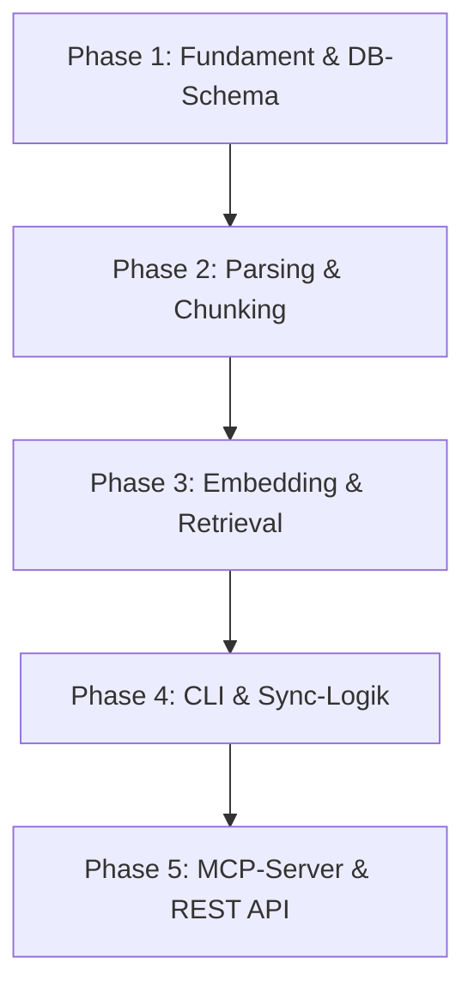

# Symaira-Seek: Architektur- und Implementierungsplan

Symaira-Seek ist ein lokales, CGO-freies Dokumenten-Retrieval-Tool für AI-Agents, das als CLI-Werkzeug, MCP-Server und lokaler HTTP-Daemon bereitgestellt wird. Es basiert auf dem SQLite + FTS5 + Vektorsuche + RRF (Reciprocal Rank Fusion) Hybrid-Search-Muster.

Dieses Dokument beschreibt den 5-Phasen-Implementierungsplan für das Fundament und die Architektur des Tools.

---

## Phasenübersicht



---

## Phase 1: Fundament & DB-Schema (CGO-freies SQLite)
In dieser Phase legen wir das Projekt-Fundament und richten die SQLite-Datenbank ein. Um die Symaira-Designrichtlinien einzuhalten, verwenden wir eine **100% CGO-freie SQLite-Bibliothek** (`modernc.org/sqlite`) und aktivieren den **WAL-Mode** für sichere, parallele Lese- und Schreibzugriffe.

### Aufgaben
1. **Projektinitialisierung**:
   - Initialisierung des Go-Moduls `github.com/danieljustus/symaira-seek`.
   - Setup der Ordnerstruktur (`cmd/seek/`, `internal/db/`, `internal/parser/`, `internal/engine/`, `internal/mcp/`, `internal/server/`).
   - Erstellung der Entwickler-Richtlinien (`CLAUDE.md`, `AGENTS.md`).
2. **Datenbank-Schema-Design**:
   - Tabelle `documents` zur Speicherung von Metadaten und Hashes indizierter Dokumente:
     ```sql
     CREATE TABLE IF NOT EXISTS documents (
         path TEXT PRIMARY KEY,
         hash TEXT NOT NULL,
         updated_at DATETIME NOT NULL
     );
     ```
   - Tabelle `chunks` zur Speicherung von Textfragmenten und deren Embeddings:
     ```sql
     CREATE TABLE IF NOT EXISTS chunks (
         id TEXT PRIMARY KEY,
         document_path TEXT NOT NULL,
         chunk_index INTEGER NOT NULL,
         content TEXT NOT NULL,
         embedding TEXT NOT NULL, -- JSON-kodierte Vektordaten
         hash TEXT NOT NULL,
         FOREIGN KEY(document_path) REFERENCES documents(path) ON DELETE CASCADE
     );
     ```
   - FTS5-Virtual-Table `chunks_fts` für performantes Keyword-Matching:
     ```sql
     CREATE VIRTUAL TABLE IF NOT EXISTS chunks_fts USING fts5(
         content,
         content='chunks',
         content_rowid='id'
     );
     ```
   - Trigger zur automatischen Synchronisation von FTS5 bei Insert/Delete auf `chunks`.
3. **Core DB-Helper & Cosine-Similarity**:
   - Implementierung von CRUD-Funktionen für Dokumente und Chunks.
   - Implementierung der mathematisch optimierten Cosine-Similarity-Berechnung in Go für das Vektor-Rescoring.

---

## Phase 2: Parsing & Chunking Engine
Diese Phase implementiert das Einlesen und Zerschneiden von Dokumenten. Ziel ist es, Dokumente in überschaubare, semantisch sinnvolle Chunks zu unterteilen und inkrementell zu verarbeiten.

### Aufgaben
1. **Dateisystem-Parser**:
   - Implementierung eines universellen Parsers für Markdown-Dateien (`.md`), reine Textdateien (`.txt`) und Standard-Quellcode-Dateien (`.go`, `.py`, `.js`, etc.).
   - Extrahieren von Header-Strukturen und Datei-Metadaten.
2. **Recursive Character Text Splitter**:
   - Implementierung eines Algorithmus, der Texte anhand einer Hierarchie von Separatoren (`\n\n`, `\n`, ` `, ``) splittet.
   - Zielgröße: 400–512 Tokens (oder Zeichen als Näherung) mit 10–20% Overlap.
3. **Change Detection (SHA-256)**:
   - Implementierung von SHA-256-Hashing auf Chunk- und Dateiebene.
   - Algorithmus zur Feststellung, ob ein Dokument modifiziert wurde, um unnötige Embedding-Generierungen zu vermeiden.

---

## Phase 3: Embedding & Retrieval Pipeline
Hier implementieren wir die Kernfunktionalität für Vektorberechnung und die hybride Suche.

### Aufgaben
1. **Duale Embedding-Pipeline**:
   - Primäre Anbindung an eine lokale **Ollama-Instanz** (`nomic-embed-text` mit 768 Dimensionen).
   - Robuster, deterministischer **Local Hash-Vector Fallback** (pure Go), falls kein Ollama erreichbar ist. Dadurch bleibt das Tool auch offline/stand-alone lauffähig.
2. **Hybrid-Search Engine**:
   - **BM25 Search**: Abfrage der SQLite FTS5 Tabelle zur Ermittlung exakter Worttreffer.
   - **Vector Search**: Kosinus-Ähnlichkeitssuche über die in SQLite gespeicherten Chunks.
3. **RRF (Reciprocal Rank Fusion)**:
   - Zusammenführung und Neugewichtung der Suchergebnisse basierend auf Ranks statt Scores.
   - Formel: $RRF(d) = \sum_{m \in M} \frac{1}{60 + r_m(d)}$
   - Rückgabe der Top-$K$ relevantesten Dokument-Ausschnitte.

---

## Phase 4: CLI & Sync-Logik
In dieser Phase stellen wir die Benutzeroberfläche für Entwickler und den Dateisystem-Synchronisationsmechanismus fertig.

### Aufgaben
1. **Cobra CLI Setup**:
   - Erstellung des globalen CLI-Alias `seek`.
   - Implementierung von:
     - `seek search "Suchbegriff"`: Gibt hybride Suchergebnisse standardisiert oder als JSON aus.
     - `seek index /pfad/zu/ordner`: Scannt und indiziert ein lokales Verzeichnis.
     - `seek status`: Zeigt Statistiken über indexierte Dokumente, Chunks und Datenbankgröße an.
     - `seek config`: Konfiguriert Pfade und API-URLs.
2. **Sync-Daemon / Verzeichnisscanner**:
   - Implementierung eines Crawlers, der Verzeichnisse scannt, geänderte Dateien (SHA-256-Abgleich) neu indiziert und gelöschte Dateien aus der DB bereinigt.
   - Vermeidung von Race Conditions durch eine queue-basierte Verarbeitung mit Backpressure.

---

## Phase 5: MCP-Server & REST API Integration
Die letzte Phase öffnet die Retrieval-Engine für AI-Agents und andere Systemprozesse über das Model Context Protocol (MCP) und eine lokale REST API.

### Aufgaben
1. **MCP-Server (stdio/JSON-RPC 2.0)**:
   - Implementierung des MCP-Protokolls über Standard I/O.
   - **Zero Stdio Pollution**: Alle Diagnosemeldungen, Logs und Fehler müssen strikt nach `os.Stderr` umgeleitet werden, da `os.Stdout` exklusiv für JSON-RPC reserviert ist.
   - Registrierung und Implementierung der 5 Kernwerkzeuge:
     - `search_documents(query, limit)`: Führt die hybride Suche durch.
     - `read_document(path)`: Gibt den vollständigen Dateiinhalt zurück.
     - `list_documents(folder)`: Erlaubt das Browsen von Dokumentenstrukturen.
     - `get_context(topic)`: Liefert formatierten RAG-Kontext.
     - `index_document(path)`: Indiziert eine neue Datei manuell.
2. **Lokaler HTTP Daemon (REST API)**:
   - Starten eines HTTP-Servers auf localhost (Port `8788`).
   - Bereitstellung von JSON-Endpunkten für Suche und Indexierungs-Status.
   - Optionale Server-Sent Events (SSE) für Streaming-Ergebnisse.
3. **Abschluss & Testabdeckung**:
   - Validierung der End-to-End-Pipeline.
   - Unit-Tests für DB, Parser, Cosine Similarity und RRF-Fusion.
