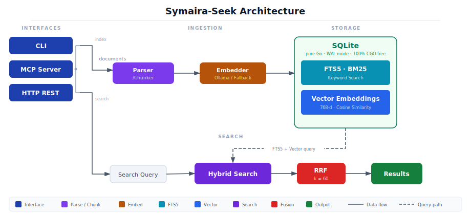

# Symaira-Seek

> Local-first, CGO-free document retrieval for AI agents with hybrid BM25+vector search.



[](https://github.com/danieljustus/symaira-seek/actions/workflows/ci.yml)
[](https://go.dev/)
[](https://opensource.org/licenses/MIT)

Symaira-Seek is a local-first, CGO-free document retrieval tool designed for AI agents and developers. It provides hybrid search (BM25 keyword search combined with vector semantic search) and fuses results using Reciprocal Rank Fusion (RRF).

## Why Symaira-Seek?

- **100% CGO-free**: Pure Go SQLite driver (`modernc.org/sqlite`) — cross-compile anywhere without C dependencies
- **Hybrid search**: Combines BM25 keyword matching with vector semantic search for better relevance
- **Dual embedding modes**: Local Ollama integration for quality, deterministic fallback for offline usage
- **Multiple interfaces**: CLI, MCP server for AI agents, and HTTP REST daemon
- **Local-first**: Your data stays on your machine — no cloud dependencies required
- **LLM re-ranking**: Optional Ollama-based re-ranking of search results for improved relevance
- **HyDE query expansion**: Optional Hypothetical Document Embeddings for better query understanding

It exposes multiple interfaces:
1. **Command Line Interface (CLI)**: A Unix-friendly command utility.
2. **Model Context Protocol (MCP)**: Native stdio-based tool integration for AI agents (Claude, Cursor, ChatGPT, etc.).
3. **HTTP REST Daemon**: A lightweight localhost API with search and index endpoints.

## Tech Stack & Architecture

- **Language**: Pure Go (1.26+)
- **Database**: SQLite (via pure-Go `modernc.org/sqlite` to maintain **100% CGO-free compilation**)
- **Keyword Search**: SQLite FTS5 with BM25 ranking
- **Vector Search**: Cosine similarity calculations on normalized 768-dimensional float32 arrays
- **Result Fusion**: Reciprocal Rank Fusion (RRF) with parameter $k=60$
- **Embeddings**: Dual-mode generation:
  - **Local Ollama Integration**: Uses the `nomic-embed-text` model.
  - **Deterministic Local Fallback**: Fallback word-hash vector generator to allow 100% offline usage.

---

## Installation & Setup

### Homebrew (macOS/Linux)

Install via Homebrew tap:

```bash
brew tap danieljustus/tap
brew install symseek
```

### Pre-built Binaries (Recommended)

Download the latest release for your platform from [GitHub Releases](https://github.com/danieljustus/symaira-seek/releases):

- **Linux**: `symaira-seek_Linux_x86_64.tar.gz` or `symaira-seek_Linux_arm64.tar.gz`
- **macOS**: `symaira-seek_Darwin_x86_64.tar.gz` or `symaira-seek_Darwin_arm64.tar.gz`
- **Windows**: `symaira-seek_Windows_x86_64.zip` or `symaira-seek_Windows_arm64.zip`

Extract and install:
```bash
# Linux/macOS
tar -xzf symseek_*.tar.gz
chmod +x symseek
sudo mv symseek /usr/local/bin/

# Windows
# Extract the .zip and add to PATH
```

### macOS App (Symseek.app)

For macOS users who prefer a native GUI, download `Symseek.dmg` from [GitHub Releases](https://github.com/danieljustus/symaira-seek/releases):

1. Open the downloaded DMG.
2. Drag `Symseek.app` into `/Applications`.
3. Launch `Symseek.app` from Launchpad or Finder.

The app bundles the Go backend and runs it as a local daemon via `SymairaDaemonKit`. It uses the same SQLite database and configuration as the CLI, so indexes and settings are shared.

To build the app from source, ensure you have Xcode installed (the CI build uses `DEVELOPER_DIR=/Applications/Xcode-beta.app/Contents/Developer`) and run:

```bash
./client/build.sh
```

This produces `client/build/Symseek.app` and `client/build/Symseek.dmg`.

> Note: The macOS app is also embeddable as a module in the Symaira Hub via `SymseekModuleView`. Its expected CLI JSON schema version is `1`.

Verify the installation:
```bash
symseek version
symseek version --json
```

### Build from Source

Ensure you have [Go](https://go.dev/) installed.

```bash
go build -o symseek cmd/symseek/main.go
```

To inject a version string at build time, set `main.version` via `-ldflags`. The CI workflow derives the value from the current git tag (or a `0.0.0-dev+<short-sha>` fallback) and passes it automatically:
```bash
VERSION="v2.3.0"
go build -ldflags "-s -w -X main.version=${VERSION}" -o symseek cmd/symseek/main.go
./symseek version
```

### Run Tests
```bash
go test -v ./...
```

---

## CLI Usage

### Index a Directory
Crawl and index all markdown, text, code, JSON, and yaml files inside a folder:
```bash
./symseek index /path/to/my-documents
```

#### Watch Daemon
Keep the tool running in the background to automatically synchronize changes (creation, modification, and deletion of files) every 5 seconds:
```bash
./symseek index /path/to/my-documents --watch
```

### Search Documents
Perform a hybrid semantic and keyword search:
```bash
./symseek search "renewable energy optimization" --limit 5
```

Export structured search results directly to JSON:
```bash
./symseek search "renewable energy optimization" --json
```

Restrict a search to a subtree with `--path`:
```bash
./symseek search "renewable energy optimization" --path /home/user/documents/project-a --limit 5
```

### Grounded Extraction Sidecars

If your documents have associated extraction sidecars (for example, produced by a `symingest` annotation pipeline), symseek can index them and search the extracted values and evidence.

A sidecar is a JSONL file stored in `.symaira/extractions/<sha256-of-source>.jsonl`, where `<sha256-of-source>` is taken from the source Markdown file's YAML frontmatter:

```yaml
---
sha256: <hex-digest>
---
```

During indexing, symseek auto-detects matching sidecars for Markdown files. You can also import a sidecar manually for an already-indexed document:

```bash
./symseek extract import /path/to/sidecar.jsonl
```

Search indexed extractions:

```bash
./symseek extract search "deadline" --limit 10
./symseek extract search "amount" --json
```

List extractions by class:

```bash
./symseek extract list --class deadline --limit 20
./symseek extract list --json
```

Each result includes the document path, extraction class, value, matched flag, and the evidence snippet with character offsets.

### Get Database Stats
```bash
./symseek status
```

Export the same stats as JSON for monitoring pipelines:
```bash
./symseek status --json
```

### Configuration

`symseek` stores its configuration as TOML in `~/.config/symseek/config.toml` (overridable with `--config`). A legacy `config.json` from older versions is migrated to TOML automatically on first run (and via `./symseek migrate`).

View the active configuration (the path is printed to stderr):
```bash
./symseek config
```

Set a value without editing the file by hand:
```bash
./symseek config --set-key ollama_url --set-value http://localhost:11434/api/embeddings
./symseek config --set-key model --set-value mxbai-embed-large
```

The file is rewritten with mode `0600` on every write. Supported keys:

| Key | Description | Default |
| --- | --- | --- |
| `ollama_url` | Ollama embeddings endpoint URL | `http://localhost:11434/api/embeddings` |
| `model` | Embedding model name | `nomic-embed-text` |
| `embedding_dim` | Embedding dimension (0 = auto-detect from model) | `0` |
| `timeout_seconds` | Per-request Ollama timeout (seconds) | `120` |
| `retry_count` | Number of Ollama retries on failure | `2` |
| `retry_backoff_ms` | Initial retry backoff (milliseconds) | `500` |
| `index_cooldown_seconds` | Cooldown between `/index` requests on the HTTP daemon | `5` |
| `vector_backend` | Database backend for vector storage (only `"sqlite"` supported) | `"sqlite"` |
| `vector_quantization` | Quantized search mode: `"off"` or `"turbo-prod"` | `"off"` |
| `vector_quant_bits` | Quantization bit width (2, 3, or 4) | `4` |
| `vector_quantized_shortlist` | Approximate shortlist size for quantized search | `200` |
| `vector_exact_rerank` | Exact cosine rerank on quantized shortlist (recommended) | `true` |
| `rerank_query` | Enable Ollama re-ranking of search results | `false` |
| `rerank_model` | Chat model for re-ranking (empty = reuse embedding model) | `""` |
| `rerank_timeout_seconds` | Per-request timeout for re-ranking | `120` |
| `expand_query` | Enable HyDE query expansion via Ollama chat | `false` |
| `expand_model` | Chat model for expansion (empty = reuse embedding model) | `""` |
| `expand_timeout_seconds` | Per-request timeout for query expansion | `120` |

### Quantized Vector Search (Opt-In)

TurboQuant quantized search trades a small amount of recall for significantly faster vector search on large indexes. It compresses float32 embeddings to 2-4 bit codes, uses those codes to produce an approximate shortlist, then re-scores only the shortlist with exact cosine similarity.

**Enable:**
```toml
# ~/.config/symseek/config.toml
vector_quantization = "turbo-prod"
vector_quant_bits = 4
vector_quantized_shortlist = 200
vector_exact_rerank = true
```

Or via CLI:
```bash
./symseek config --set-key vector_quantization --set-value turbo-prod
./symseek config --set-key vector_quant_bits --set-value 4
```

**Build sidecars** (required after enabling or re-indexing):
```bash
./symseek quantize --bits 4 --seed 42
```

**Disable** (reverts to exact search):
```toml
vector_quantization = "off"
```

**Benchmarks:**
```bash
go test -bench=. -benchmem ./internal/db/ -run='^$' -bench=BenchmarkSearch
```

The shortlist size controls speed/quality trade-off: lower = faster, higher = better recall. The `vector_exact_rerank = true` setting (default) ensures final results use exact cosine similarity on the shortlisted candidates.

---

## MCP Server Integration

To use Symaira-Seek as an MCP tool for AI clients (like Claude Desktop or Cursor), register it in your client's configuration file:

```json
{
  "mcpServers": {
    "symaira-seek": {
      "command": "/absolute/path/to/symaira-seek/symseek",
      "args": ["serve"]
    }
  }
}
```

### Exposed Tools
1. `search_documents(query, limit, format, path_prefix)`: Hybrid search over all indexed files. Returns structured results with stable chunk IDs, character offsets, RRF scores, and snippets.
2. `read_document(path, fromLine?, maxLines?)`: Retrieves content from an indexed file, with optional line-range filtering.
3. `list_documents(folder)`: Explorative folder and index structure scanning.
4. `get_context(topic, max_chars)`: Aggregates relevant context blocks from multiple documents.
5. `index_document(path)`: Manually indexes a local file or directory.
6. `index_url(url)`: Indexes content from a URL.
7. `multi_get(pattern, maxBytes, maxLines)`: Retrieves multiple indexed documents matching a glob pattern.
8. `set_context(path, text)`: Stores descriptive context text for a filesystem path prefix.
9. `get_contexts()`: Lists all stored folder context entries.
10. `search_extractions(query, limit)`: Full-text search over grounded document extractions (values and evidence text).
11. `list_extractions(class?, limit)`: Lists grounded extractions, optionally filtered by class (e.g. `amount`, `deadline`).
12. `get_document_extractions(path)`: Retrieves all extractions for a specific indexed document.

### Tool Examples

#### search_documents
```json
{
  "query": "renewable energy optimization",
  "limit": 5,
  "format": "json"
}
```

Returns structured search results (default `format`: `json`). Each hit contains the document path, stable chunk ID, character offsets into the source document, RRF score, and a snippet. Use `format: "text"` for the legacy human-readable output.

Example result:
```json
[
  {
    "path": "/home/user/documents/report.md",
    "chunk_id": "a1b2c3d4...",
    "char_start": 1240,
    "char_end": 1890,
    "score": 0.0342,
    "snippet": "renewable energy optimization..."
  }
]
```

Scope the search to a subtree with `path_prefix`:
```json
{
  "query": "renewable energy optimization",
  "limit": 5,
  "path_prefix": "/home/user/documents/project-a"
}
```

#### read_document
```json
{
  "path": "/home/user/documents/report.md",
  "fromLine": 10,
  "maxLines": 5
}
```

Returns lines 10-14 of the document. Both `fromLine` (1-based) and `maxLines` are optional; omitting them returns the complete file.

Returns the full text content of an indexed file.

#### list_documents
```json
{
  "folder": "/home/user/documents"
}
```

Lists all indexed documents, optionally filtered by folder prefix.

#### get_context
```json
{
  "topic": "machine learning",
  "max_chars": 4000
}
```

Aggregates relevant context blocks from multiple documents for a given topic.

#### index_document
```json
{
  "path": "/home/user/documents"
}
```

Indexes a local file or directory immediately.

#### index_url
```json
{
  "url": "https://example.com/article"
}
```

Fetches and indexes content from a URL.

#### multi_get
```json
{
  "pattern": "docs/**/*.md",
  "maxBytes": 10485760,
  "maxLines": 500
}
```
Retrieves all indexed documents matching the glob pattern. Files exceeding `maxBytes` or `maxLines` are skipped with an info message.

#### set_context
```json
{
  "path": "/home/user/docs/api",
  "text": "API documentation for the project"
}
```
Stores a context annotation for a path prefix. Subsequent `search_documents` results will display the matching context when a result's path falls under this prefix (longest-prefix match).

#### get_contexts
```json
{}
```
Lists all stored folder context entries, showing each path prefix and its associated context text.

### Environment Variables

| Variable | Description |
| --- | --- |
| `SEEK_API_TOKEN` | Bearer token required by the HTTP REST daemon (`/search`, `/index`, `/status`). When unset, the daemon is accessible to any local process. |
| `SEEK_ALLOW_PRIVATE_URLS` | Set to `1` or `true` to allow `index_url` to fetch private, loopback, or link-local addresses. Without this, `index_url` refuses non-public targets to prevent SSRF. |

---

## HTTP REST Daemon

Start the REST API on port `8788`:
```bash
./symseek serve --port 8788
```

### Endpoints
- **GET** `/health`: Check status (`{"status": "ok"}`).
- **GET** `/status`: Returns document counts, chunk counts, and database file size.
- **GET** `/search?q=query&limit=5`: Query the hybrid search engine.
- **POST** `/index` with body `{"path": "/absolute/path"}`: Synchronously crawl and index a folder.

### Endpoint Examples

#### Health Check
```bash
curl http://localhost:8788/health
# Response: {"status": "ok"}
```

#### Get Status
```bash
curl http://localhost:8788/status
# Response: {"documents": 10, "chunks": 50, "db_size": "1.2 MB"}
```

#### Search Documents
```bash
curl "http://localhost:8788/search?q=machine+learning&limit=5"
# Response: Array of search results with file paths and scores
```

#### Index Documents
```bash
curl -X POST http://localhost:8788/index \
  -H "Content-Type: application/json" \
  -d '{"path": "/home/user/documents"}'
# Response: {"status": "indexed", "path": "/home/user/documents"}
```

---

## License

MIT License. Part of the Symaira tool suite.
