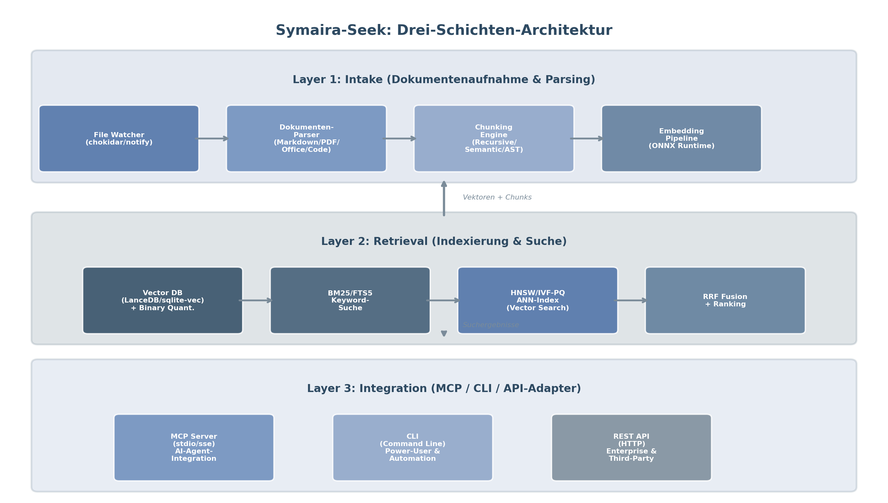
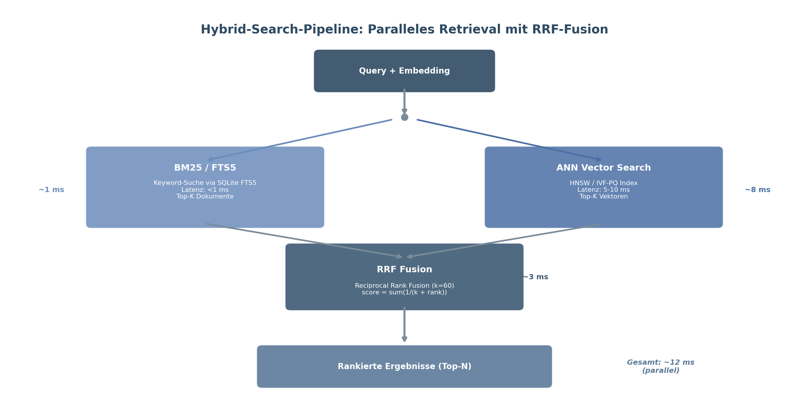
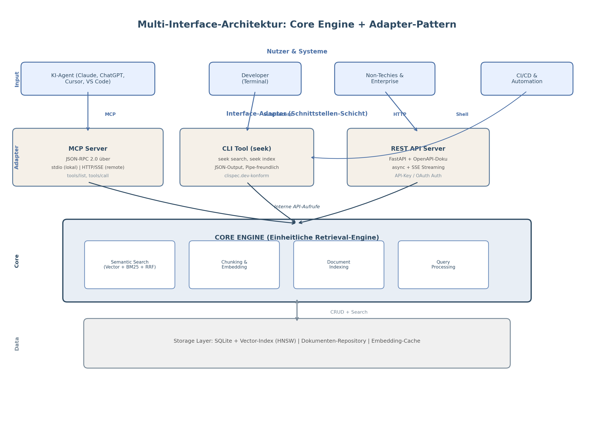
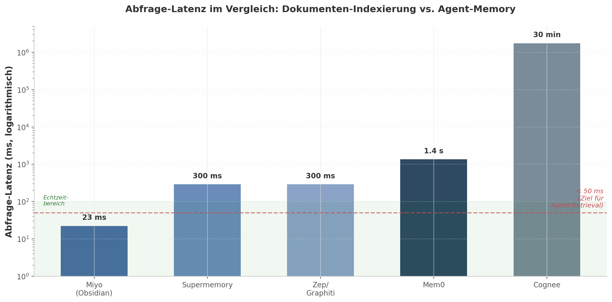

# Symaira-Seek — Architecture Research (distilled)

> **Provenance.** This document distills the original "Symaira-Seek" deep-research
> report (Kimi, June 2026) down to the parts that inform Symaira-Seek's design and
> open feature work. The original ~150 KB report and its raw dimension files are
> **not** kept in the repo; everything actionable from it lives here. Numbers and
> claims below are paraphrased from that report — treat target figures as design
> goals, not measured results for this implementation.

The thesis of the report: there is a market gap for a **local-first, open-source,
MCP-native document-retrieval tool** for AI agents. The proven reference is Miyo
(Obsidian Copilot): SQLite + FTS5 + local embeddings + incremental indexing +
hybrid BM25/vector search + RRF, reportedly ~23 ms P50 latency on consumer
hardware. Symaira-Seek generalizes that pattern to arbitrary folders.

## Contents

- [Already implemented](#already-implemented)
- [Open recommendations → issues](#open-recommendations--issues)
  - [PDF & Office parsing](#pdf--office-parsing) → #135
  - [Binary quantization + Hamming pre-filter](#binary-quantization--hamming-pre-filter) → #136
  - [`find` / filesystem-for-AI navigation](#find--filesystem-for-ai-navigation) → #137
  - [Secret / credential filtering](#secret--credential-filtering) → #138
  - [Line-number citations](#line-number-citations) → #139
  - [Configurable & structure-aware chunking](#configurable--structure-aware-chunking) → #140
  - [Retrieval evaluation metrics](#retrieval-evaluation-metrics) → #141
  - [Embedding flexibility (Matryoshka / providers)](#embedding-flexibility-matryoshka--providers) → #142
  - [Polling fallback for network drives](#polling-fallback-for-network-drives) → #143
- [Out of scope for this repo](#out-of-scope-for-this-repo)
- [Diagrams](#diagrams)

---

## Already implemented

The core architecture the report recommends already exists in this repo:

- **Three-layer architecture** — intake (`internal/parser`) → retrieval
  (`internal/engine`, `internal/db`) → integration (`internal/mcp`,
  `internal/server`, `cmd/symseek`).
- **Hybrid search**: SQLite FTS5 (BM25) + cosine vector scan, fused with
  **Reciprocal Rank Fusion** (k = 60).
- **CGO-free** SQLite (`modernc.org/sqlite`) with WAL mode — statically linkable
  on every target. This constraint deliberately rules out native ANN libraries
  (hnswlib/FAISS/sqlite-vss); see `ARCHITECTURE_PLAN.md`.
- **Dual embeddings**: local Ollama (`nomic-embed-text`, 768-dim) with a
  deterministic pure-Go hash-vector fallback for fully offline operation.
- **Three interfaces**: CLI, MCP (stdio/JSON-RPC), and a localhost HTTP REST
  daemon (incl. **SSE** streaming).
- **Incremental indexing**: SHA-256 change detection at file/chunk level,
  parallel indexing, orphan cleanup.
- **Event-based watching** via `fsnotify` (replaced the old polling loop).
- **Local-first & read-by-default**: path restrictions, SSRF guards on URL
  indexing, constant-time bearer-token comparison, rate limiting, ReDoS-safe
  regexes, `0600` config, and a `delete` command (supports the "right to be
  forgotten" use case locally).

## Open recommendations → issues

Each section below is the rationale + key data backing one open issue.

### PDF & Office parsing
**Issue: #135** · report §2.4.3

The report recommends supporting **Markdown, PDF, Office documents, and code
files**. Today only text/code extensions are crawled (`internal/engine/sync.go`,
`supportedExtensions`) and `internal/parser/parser.go` treats every file as UTF-8
text — so PDFs/Office docs are skipped or indexed as garbage. For a "any folder"
retrieval tool these are the most common real-world content.

Stay CGO-free: pure-Go PDF text extraction (e.g. `github.com/ledongthuc/pdf`);
DOCX = ZIP of XML, parseable with stdlib `archive/zip` + `encoding/xml`. OCR for
scanned PDFs is out of scope.

### Binary quantization + Hamming pre-filter
**Issue: #136** · report §2.2.4, §5.1.2, Insight 5

The report's single biggest local-performance lever. Binary quantization is cited
as **~32× memory reduction and 15–45× faster search at >95% accuracy retention**
(~38 MB vs ~160 MB for 10k docs at 384-dim).

Achievable **without CGO**: store a 1-bit-per-dimension packed signature (sign of
each dimension) alongside each float32 embedding. Two-stage search:
1. Rank all chunks by **Hamming distance** (`bits.OnesCount` over `uint64` words —
   integer only, no `content` read).
2. Exact cosine rescoring over only the top-N candidates.

This keeps the full-scan recall guarantee (cf. closed issue #65) while deferring
expensive float work. Recommended as the **default** with an accuracy opt-out.
Directly mitigates the O(n) linear-scan trade-off documented in
`ARCHITECTURE_PLAN.md`.

Latency budget the report targets: **<50 ms E2E** = BM25 (<15 ms) + vector
(<20 ms) + RRF (<5 ms) + overhead (<10 ms).

### `find` / filesystem-for-AI navigation
**Issue: #137** · report §4.1.1, §4.1.3, Insight 7, §6.2.2

Dust.tt's "Filesystem for AI" finding: agents need **structural navigation**
(`list`, `find`, `cat`) **alongside** semantic `search`. Unix-style commands are
already in LLM pre-training, so they're token-efficient and reliably used (Letta
filesystem tools reportedly hit 74% LoCoMo with gpt-4o-mini, beating specialized
memory libraries). §6.2.2 lists the read tool surface explicitly as
`search`, `list`, `read`, **`find`**.

Today the MCP server has `search_documents`, `read_document`, `list_documents`,
`get_context`, `index_document`, `index_url` — but **no glob/pattern `find`**.
Add `find_documents(pattern, limit)` (MCP) + `symseek find` (CLI, `--json`),
read-only, sub-second (metadata-only lookup against `documents`).

Tool-routing guidance (report §4.1.3): exploratory queries → `list`/`find`;
targeted → `search`; detail → `read`. Latency-critical tools should answer
<100 ms to keep an agent ReAct loop fluid.

### Secret / credential filtering
**Issue: #138** · report §6.2.1, §6.1

Local folders often hold API keys, tokens, passwords, private keys. If indexed
unfiltered, an MCP query could surface them to an agent. Recommended: pattern
matching for known formats (AWS keys, GitHub tokens, PEM blocks) + entropy-based
detection of random high-entropy strings; **mask or exclude before indexing**.
Aligned with the privacy-first brand promise. Keep it pure-Go, high-precision
(false positives mangle content), configurable (`off`/`redact`/`skip`, default
`redact`). GitLeaks / Yelp detect-secrets are good references for the regex corpus.

### Line-number citations
**Issue: #139** · report §4.2.1, §4.2.2

Citation-aware RAG rule: every claim must map back to a retrieved chunk, so each
chunk needs a precise locator — **at minimum file path + line number** (ideally
+ chunk index, page, date, author). Today chunks are located only by
`document_path` + `chunk_index`; there is no line information.

Capture start/end line offsets at chunk time (the splitter already walks the
text), persist `line_start`/`line_end` (additive migration), and surface them in
CLI `search`, MCP `search_documents`, and `get_context` — ideally as numbered
references `[1] path:line_start-line_end`.

### Configurable & structure-aware chunking
**Issue: #140** · report §2.4.1, §2.4.2

Recommended default: recursive character splitting at **400–512 tokens with
10–20% overlap**; advanced: **structure-aware** splitting (respect Markdown
headers, never split inside fenced code blocks); optional semantic chunking
(+9% recall, 2–5× cost — out of scope).

Today `internal/engine/sync.go` hardcodes `SplitText(content, 1000, 200)` (chars,
not tokens, above the recommended range) and the splitter is purely
separator-based. Make `chunk_size`/`chunk_overlap` configurable (TOML +
threaded through indexing) and add Markdown/code structure awareness.

OpenAI File Search defaults cited as a reference point: 800-token chunks, 400
overlap, max 20 chunks in context.

### Retrieval evaluation metrics
**Issue: #141** · report §4.3.1

Standard IR metrics for the retrieval module, with the report's target values:

| Metric | Measures | Target |
|---|---|---|
| Hit Rate @k | ≥1 relevant result in top-k | >95% @k=10 |
| MRR | reciprocal rank of first relevant | >0.70 |
| NDCG @k | graded relevance, log discount | >0.75 @k=10 |
| Latency P50 / P99 (per tool call) | typical / worst case | <100 ms / <500 ms |

Add a small fixture-based harness (`internal/eval` + `testdata/` judgments)
computing these against `SearchHybrid`, optionally a hidden `symseek eval`
command, wired into CI as a non-gating report first. Full RAGAS / LLM-judge
end-to-end evaluation (report §4.3.2) belongs to the agent layer, not this tool.

### Embedding flexibility (Matryoshka / providers)
**Issue: #142** · report §2.3.1, §2.3.2, Insight 8

The report wants a *pluggable* embedding pipeline letting users trade speed
(small/low-dim models, e.g. `potion-base-8M` at 256-dim) for quality
(`nomic-embed-text` at 768-dim), including **Matryoshka dimension truncation**
(lower dim → less storage, faster scan). Today only `ollama_url`/`model` are
configurable and the dimension is implicitly fixed at 768.

Add a configurable `embedding_dim` (truncate + re-normalize for Matryoshka-capable
models), validate stored-vs-configured dimension to prevent mixing, and formalize
provider selection (the `Embedder` interface already allows alternates). Pairs
naturally with binary quantization (#136). Local-first stays the default
(Insight 8) — this is about local flexibility, not pushing cloud embedding APIs.

### Polling fallback for network drives
**Issue: #143** · report §2.5.1, Insight 9

`fsnotify` relies on OS kernel notifications that **do not propagate over network
filesystems** (SMB/CIFS, NFS) and can be flaky on FUSE. The report recommends
event-driven watching **plus a polling fallback for network drives**. Add an
optional periodic SHA-256 directory-diff sweep (reusing existing change
detection), auto-enabled on detected network mounts or via `--poll-interval`,
default off for local paths. Incremental UX matters: the report frames
"<10 s to find a changed doc" as the line between "works" and "feels broken"
(Insight 9).

## Out of scope for this repo

These report topics belong elsewhere or are deliberate non-goals:

- **Cloud-Pro**: managed hosting, cross-device sync, team features, the Obsidian-
  style "pay for convenience, not features" business model, pricing (report §7) →
  `symaira-seek-pro`.
- **E2E / property-preserving encryption** for cloud sync, **GDPR DPA/DPIA**
  obligations (report §6.3) → cloud component only; the local tool processes no
  data on Symaira's behalf.
- **ANN index** (HNSW/IVF-PQ): a deliberate non-goal under the CGO-free
  constraint; #136 (binary quantization) is the chosen pure-Go performance
  answer instead.
- **Query rewriting / HyDE / multi-query / ReAct loops** (report §4.1.2): the
  report itself scopes these as *agent-side logic*, not retrieval-tool features.
- **Naming analysis** (report §8): resolved — `symaira-seek` / `symseek`.

## Diagrams

Distilled from the original report (in [`diagrams/`](diagrams/)):

- 
  **Three-layer architecture** — intake → retrieval → integration.
- 
  **Hybrid search pipeline** — BM25 + vector → RRF fusion.
- 
  **Multi-interface** — one core engine, MCP/CLI/REST adapters.
- 
  **Latency comparison** — context for the <50 ms E2E target.
